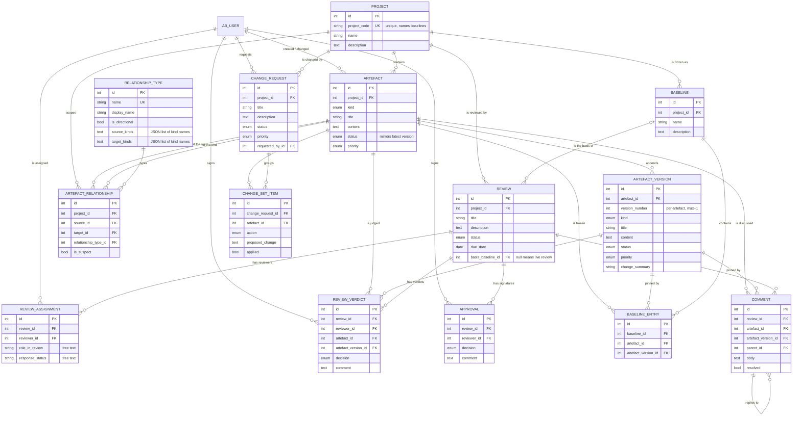
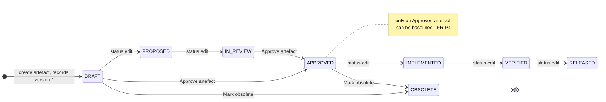
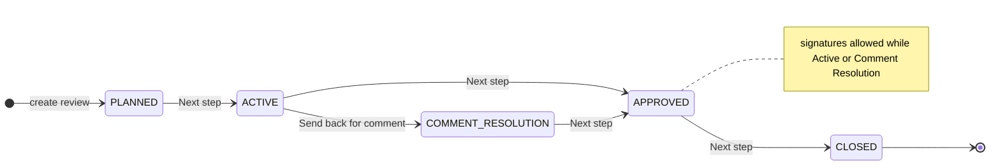
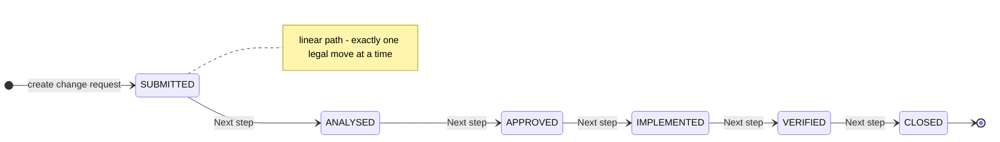
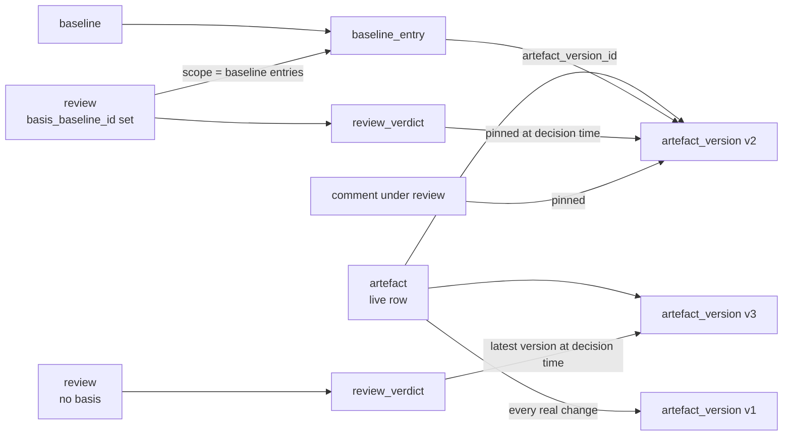

# REQMan Domain Model

> Source of truth: [`app/models.py`](../app/models.py) (14 domain tables, 7 enums), cross-checked
> against the live SQLite schema in `app.db` (`PRAGMA table_info` / `foreign_key_list` / `index_list`)
> and against the rules in [`app/services.py`](../app/services.py).
> Stack: Flask-AppBuilder 5.2 · SQLAlchemy 2.x · SQLite (`create_all`, no Alembic).
> See also: [`minimal_spec.md`](minimal_spec.md) §3–§4 for the functional requirements these tables serve.

---

## 1. Shape of the domain

REQMan is a **configuration-managed requirements store**. Four concerns hold it together:

| Layer | Tables | Responsibility |
|---|---|---|
| **Scope** | `project` | Everything else is project-scoped; it is the unit of baselining and permissions. |
| **Content + history** | `artefact`, `artefact_version` | One live row per managed object, plus an append-only snapshot on every real change. |
| **Structure** | `relationship_type`, `artefact_relationship` | Typed, validated, directed trace links with a *suspect* flag. |
| **Governance** | `baseline`, `baseline_entry`, `review`, `review_assignment`, `review_verdict`, `comment`, `approval`, `change_request`, `change_set_item` | Freeze content (`baseline`), judge it (`review`/`verdict`/`approval`/`comment`), change it under control (`change_request`/`change_set_item`). |

The single most important idea: **evidence never points at a live row.** A baseline entry, a verdict
and a review comment all reference an `artefact_version`, so a decision stays about *what was
actually reviewed* even after the artefact moves on.



*`AB_USER` is Flask-AppBuilder's own security table (`app/models.py` imports `User` from
`flask_appbuilder.security.sqla.models`).* All tables except `baseline_entry`, `review_assignment`
and `change_set_item` also carry `created_on`, `changed_on`, `created_by_fk`, `changed_by_fk` from
F.A.B.'s `AuditMixin`.

## 2. The three lifecycles

State is data, not code: three enum columns drive three workflows whose rules live in
`app/services.py` and are executed by F.A.B. row actions in `app/views.py`.







**Asymmetry worth knowing.** `Review` and `ChangeRequest` are fully button-driven
(`REVIEW_TRANSITIONS` / `CHANGE_TRANSITIONS`, plus the `REVIEW_ADVANCE` / `CHANGE_ADVANCE`
"next step" maps). `Artefact.status` has eight states but only **three** doors — Draft,
Approved, Obsolete — so the intermediate states are reachable only by editing the raw status field:
there is no artefact transition table in `services.py` at all.

## 3. How evidence is pinned

The model's subtlest rule: what a review *decides about* depends on whether the review has a
baseline basis. `services.review_artefact_version()` resolves it once, and the resolved version is
**copied into the row** rather than derived later.



Consequences:

* A verdict on a baseline review **cannot** move to a newer version; re-deciding re-pins to the frozen one.
* `baseline_entry` stores `artefact_id` *and* `artefact_version_id` — the latter implies the former.
  The redundancy is deliberate: it lets scope, uniqueness (`uq_baseline_entry_artefact`) and impact
  queries run without a join through versions.
* `review.progress` is a **property**, not a column (it runs `review_progress()`); it therefore must
  never appear in `order_columns` — `ReviewView` lists `order_columns` explicitly for that reason.

## 4. Enum catalogue

Seven `str, Enum` classes; SQLAlchemy stores the **member name**, while the UI shows `.value`.

| Enum | Stored (DB) | Shown (UI) | Used by |
|---|---|---|---|
| `RequirementState` | `DRAFT`, `IN_REVIEW`, `APPROVED`, … | Draft, In Review, Approved, … | `artefact.status`, `artefact_version.status` |
| `ArtefactKind` | `SYSTEM_REQ`, `TEST_CASE`, … | System Requirement, Test Case, … | `artefact.kind`, `artefact_version.kind`, `relationship_type.source_kinds/target_kinds` |
| `Priority` | `LOW` … `CRITICAL` | Low … Critical | `artefact.priority`, `artefact_version.priority`, `change_request.priority` |
| `ReviewState` | `PLANNED` … `CLOSED` | Planned … Closed | `review.status` |
| `ChangeState` | `SUBMITTED` … `CLOSED` | Submitted … Closed | `change_request.status` |
| `Decision` | `APPROVE`, `REJECT`, `ABSTAIN` | Approve / Reject / Abstain | `review_verdict.decision`, `approval.decision` |
| `ChangeAction` | `ADD`, `UPDATE`, `DELETE` | Add / Update / Delete | `change_set_item.action` |

Verified against `app.db`: `select kind, status, priority from artefact` → `('SYSTEM_REQ', 'APPROVED',
'MEDIUM')`. Every column is `native_enum=False`, i.e. plain `VARCHAR` **with no CHECK constraint**
(`SELECT … FROM sqlite_master WHERE sql LIKE '%CHECK%'` → nothing), so nothing stops an invalid value
written outside the application.

## 5. Entity reference

### `project` — the scope container
`project_code` is unique and doubles as the prefix of an auto-named baseline (`HX4 BL 2026-09-22`).
Parent of artefacts, baselines, reviews, change requests and trace links. **No cascade or
`pre_delete` guard exists**, so deleting one that has children fails quietly (see §7, F3).

### `artefact` / `artefact_version` — content and its history
The live row is a **mirror of its latest version** (FR-P3): `kind`, `title`, `content`, `status`,
`priority` are copied into every version by `services.create_version()`, and
`services.reconcile_artefact()` re-applies them if a write ever bypassed versioning.
`version_number` is a per-artefact `max+1` sequence, not a DB constraint — there is **no** unique
`(artefact_id, version_number)`. Versions are append-only (UI blocks add/edit/delete) and cascade with
their artefact (`ondelete="CASCADE"` + `cascade="all, delete-orphan"`).

### `baseline` / `baseline_entry` — configuration control
A baseline is immutable in the UI (edit/delete routes disabled) and is only ever created through
`snapshot_baseline()`, which captures **only artefacts whose latest version is `Approved`** and
skips the rest. `uq_baseline_entry_artefact` makes "one entry per artefact per baseline" a DB rule;
re-snapshotting an existing baseline is refused in code, not by the schema.

### `relationship_type` / `artefact_relationship` — traceability
A link is `(source) --type--> (target)`, project-scoped, `uq_trace_link` preventing duplicates.
Type rules are declarative but soft: `is_directional` is **never read by `validate_relationship()`**,
and `source_kinds`/`target_kinds` are JSON-as-text that `_validate_kinds()` parses leniently —
malformed JSON is silently ignored rather than rejected. `is_suspect` is set by `create_version()`
on every change to a link's *source* and cleared by the *Mark as reviewed* action.

### `review` / `review_assignment` / `review_verdict` / `approval` / `comment` — judgement
`review.basis_baseline_id` (nullable) switches the review between *live* and *frozen* semantics (§3).
`uq_review_verdict` enforces one decision per `(review, reviewer, artefact)`, which is what makes
`record_verdict()` an upsert. Signatures (`approval`) have no uniqueness rule, so idempotency is a
code guarantee of `record_approval()` only. `comment` is self-referential (`parent_id`) and may attach
to a review, an artefact, or both — the model permits a comment attached to **neither** (all three FKs
nullable, only `body` NOT NULL); the "must have context" rule is enforced only in `CommentView.pre_add`.

### `change_request` / `change_set_item` — controlled change
A request groups proposed edits; `applied` is a **manually ticked flag** — nothing applies
`proposed_change` to the artefact (deferred to FR-8's later phase), so the version stream and the
change record are not yet linked.

## 6. Relationship and deletion matrix

| Child | FK → parent | ON DELETE | ORM behaviour | Consequence |
|---|---|---|---|---|
| `artefact.project_id` | `project` | none | plain `backref("artefacts")` | project delete fails silently (F3) |
| `baseline.project_id`, `review.project_id`, `change_request.project_id`, `artefact_relationship.project_id` | `project` | none | plain backrefs | as above |
| `artefact_version.artefact_id` | `artefact` | CASCADE | `delete-orphan` | history goes with the artefact |
| `baseline_entry.baseline_id` | `baseline` | CASCADE | `delete-orphan` | contents go with the baseline |
| `baseline_entry.artefact_id`, `.artefact_version_id` | `artefact`, `artefact_version` | none | — | deletion of frozen content is blocked in `pre_delete` (F1) |
| `artefact_relationship.source_id`, `.target_id`, `.relationship_type_id` | `artefact`, `relationship_type` | none | — | blocked in `pre_delete` (F1) |
| `review_assignment.review_id`, `review_verdict.review_id`, `approval.review_id`, `comment.review_id` | `review` | CASCADE | `delete-orphan` | **deleting a review silently destroys its evidence trail** |
| `review_verdict.artefact_id`, `.artefact_version_id` | `artefact`, `artefact_version` | none | — | not covered by `pre_delete` → dangling rows (F1) |
| `comment.artefact_id`, `comment.artefact_version_id` | `artefact`, `artefact_version` | CASCADE | `backref("comments")` | comments vanish with the artefact |
| `comment.parent_id` | `comment` | none | `remote_side` self-ref | deleting a parent reply orphans its thread |
| `change_set_item.change_request_id` | `change_request` | CASCADE | `delete-orphan` | items go with the request |
| `change_set_item.artefact_id` | `artefact` | none | — | not covered by `pre_delete` → dangling (F1) |
| `review.basis_baseline_id` | `baseline` | none | `backref("basis_for_reviews")` | baselines can never be purged while a review refers to them |
| `*.reviewer_id`, `*.created_by_fk`, `*.requested_by_id` | `ab_user` | none | — | users cannot be deleted via the model; they are only deactivated by F.A.B. |

## 7. Findings and risks

Every item below was checked against `app.db` and reproduced through the running app.

**F1 — Deleting an artefact can orphan review and change evidence. (high)**
`ArtefactView.pre_delete` guards *baselines* and *trace links* only. Reproduced: an artefact
carrying one `review_verdict` deleted fine, leaving `verdicts=1, dangling=1`; the same for a
`change_set_item` (`items left=1, dangling=1`). Those FKs have no `ON DELETE`, and SQLite does not
enforce them (F2), so nothing stops it. *Fix:* extend `pre_delete` to `review_verdict` /
`change_set_item` / `comment`, or add matching DB-level protection.

**F2 — Foreign keys are declared but not enforced; enums are unchecked. (high)**
`PRAGMA foreign_keys` returns `0`, and nothing in `app/`, `config.py` or `run.py` turns it on — SQLite
requires it per connection. Combined with no CHECK constraints, referential and domain integrity rest
entirely on Python. *Fix:* an `engine_created`/`connect` event setting `PRAGMA foreign_keys=ON`, and
`create_constraint=True` (or CHECKs via migration) on the enum columns.

**F3 — Project deletion is a silent no-op. (medium)**
No cascade, `NOT NULL` child FKs and no `pre_delete` hook: deleting a project with artefacts leaves
`projects=1` and shows no flash at all — the worst UX outcome, since the user cannot tell whether it
worked. *Fix:* a `pre_delete` explaining that projects are retire-not-delete, or archive support.

**F4 — Three tables have no provenance. (medium)**
`baseline_entry`, `review_assignment` and `change_set_item` omit `AuditMixin`, so *who* froze a
version into a baseline, *who* appointed a reviewer and *when*, and *who* proposed a change are
unrecordable — despite `minimal_spec.md` §2.1 claiming "AuditMixin on all mutable entities". The
first is arguably acceptable (derived from the baseline), the other two are evidence tables.

**F5 — No index supports any relationship. (medium, scale)**
`index_list` shows only the unique-constraint auto-indexes: nothing on `artefact.project_id`,
`artefact_relationship.source_id/target_id`, `baseline_entry.*`, `review_verdict.*`, `comment.*`.
`_traverse()` (impact, graph) issues `IN (...)` per hop and `orphan_artefacts()`/`review_scope()`
scan by project — all table scans today, and the NFR target is 1M artefacts. Also
`services.landing_stats()`'s `~Artefact.id.in_(subquery)` emits an SQLAlchemy deprecation warning.

**F6 — Intentional duplication that needs its guard kept.**
`artefact` mirrors its latest version; `baseline_entry` stores both artefact and version. The drift
this invites is repaired by `reconcile_artefact()` — called from `ArtefactView._show`, i.e. a **GET
performs writes**. Worth revisiting as the model grows.

**F7 — Soft rules in the schema, hard rules in Python. (medium)**
Not enforced by the DB: version numbering uniqueness, link kind rules and `is_directional`,
`Comment` context (F-§5), approval idempotency, "only Approved is baselined", verdict scope. This is
a PoC trade-off, but it means a REST API or bulk-import path (both on the roadmap) can violate every
one of them; `review_verdict` has no check that its artefact's project equals its review's project.

**F8 — `role_in_review` / `response_status` are free text.**
Defaults `"Reviewer"` / `"Open"` with no choices list, so a review's roster can accumulate
`Chair`/`chair`/`CHAIR`. A `Priority`-style enum (or an FK to a small config table) belongs here —
it is also the field a future "am I a reviewer?" landing-page query would filter on.

**F9 — Baselines accumulate.** `BaselineView` disables delete, and `review.basis_baseline_id` has no
`ON DELETE`, so baselines are effectively permanent. Right for audit, but there is no lifecycle
status, supersede link or archive flag to stop "which of these 40 baselines is current?" becoming a
search problem.

## 8. Model ↔ requirement coverage

| Spec | Covered by | Gap |
|---|---|---|
| FR-P1 Projects | `project` | no owner, lifecycle state, tags, archive |
| FR-P2 Artefacts | `artefact` (+ `kind`) | no custom attributes, attachments, hierarchy/numbering, module grouping |
| FR-P3/FR-4 Versioning | `artefact_version`, `AuditMixin` | no diff view; no DB-level version uniqueness |
| FR-P6 Baselines | `baseline`, `baseline_entry` | no compare/restore, no baseline status |
| FR-5 Traceability | `relationship_type`, `artefact_relationship` | kind rules stored but `is_directional` unused |
| FR-7 Reviews | `review`, `review_assignment`, `review_verdict`, `approval`, `comment` | `progress` computed per row (N+1); no review report |
| FR-8 Change mgmt | `change_request`, `change_set_item` | `applied` is manual; changes are never applied to artefacts |
| NFR auditability | `AuditMixin` + pinned versions/verdicts | see F4, F1 |

---

### Regenerating this page

```bash
# schema facts used above
python - <<'EOF'
import sqlite3
db = sqlite3.connect("app.db")
for t in ("artefact", "review_verdict", "baseline_entry", "comment"):
    print(t, db.execute(f"pragma foreign_key_list({t})").fetchall())
    print("  indexes:", db.execute(f"pragma index_list({t})").fetchall())
print("FK enforcement:", db.execute("pragma foreign_keys").fetchone()[0])
EOF
```
